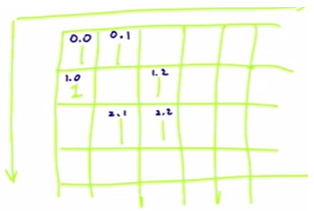

# 947. Most Stones Removed with Same Row or Column



- Want to find all possible connections of stones
  - In each connection, one stone will be left after all removal
  - Thus, the maximum possible stones to be removed is `stones.length` - `number of possible connections`
- Since stones within the same row/column can be removed, it means that the stones do not need to be a neighbor for us to connect them
  - As long as they are in the same row/column, they can be connected
- First way to find all connections are:

```java
for (int i=0; i<stones.lengths; i++) { // loop through the stones
	for (int j=i+1; j<stones.lengths; j++) {  // loop through all of the rest stones
		// check if stones[i] is in the same row/column with stones[j]
		if (stones[i][1] == stones[j][1] || stones[i][0] == stones[j][1]) {
			union(i, j);
		}
	}
}
```

- However, this solution is too slow because O(N^2*logN)
  - N^2 is the nested loop, logN is the union
- Second way to do is by connecting the row index with the column index for each stone
  - Let row and column index be [x, y]
  - The max no. of column is 10000, so we can represent the column index as 10000+y
  - (See figure)
    - for first stone, connect 0 and 10000;
    - for second stone, connect 0 and 10001 (we notice that [0, 0] and [0, 1] can be connected in this way because both have 0 as row index)
    - for third stone, connect 1 and 10000 (we notice that [0, 0] and [1, 0] can be connected in this way because both have 0 as column index)
    - And so forth

```java
for (int[] stone:stones) {
	union(stone[0], stone[1] + 10000);
}
```

- Complexity is O(NlogN)

My Submission (Complexity = O(NlongN))

```java
class Solution {
    public int removeStones(int[][] stones) {
        DSU dsu = new DSU(20000); // 20000 because the row index is 0-9999 and col index is 10000-19999
        
        for (int[] stone:stones) {
            dsu.union(stone[0], stone[1] + 10000);
        }
        
        // use a set to find all unique roots
        Set<Integer> set = new HashSet();
        for (int[] stone:stones) {
            // only need to find the root of the x-coordinate because the y-coordinate of this stone definitely has the same root as the x-coordinate
            set.add(dsu.root(stone[0]));
        }
        
        return stones.length - set.size();
    }
    
    
}

class DSU {
    private int[] parents;
    private int[] sizes;
        
    public DSU(int n) {
        parents = new int[n];
        sizes = new int[n];
        for (int i=0; i<n; i++) {
            parents[i] = i;
            sizes[i] = 1;
        }
    }
    
    public int root(int x) {
        while (parents[x] != x) {
            x = parents[x];
        }
        return x;
    }
    public void union(int x, int y) {
        int root_x = root(x);
        int root_y = root(y);
        if (sizes[root_x] < sizes[root_y]){
            parents[root_x] = root_y;
            sizes[root_y] += sizes[root_x];
        } else {
            parents[root_y] = root_x;
            sizes[root_x] += sizes[root_y];
        }
    }
}
```

Added path compression:

```java
class Solution {
    public int removeStones(int[][] stones) {
        DSU dsu = new DSU(20000); // 20000 because the row index is 0-9999 and col index is 10000-19999
        
        for (int[] stone:stones) {
            dsu.union(stone[0], stone[1] + 10000);
        }
        
        // use a set to find all unique roots
        Set<Integer> set = new HashSet();
        for (int[] stone:stones) {
            // only need to find the root of the x-coordinate because the y-coordinate of this stone definitely has the same root as the x-coordinate
            set.add(dsu.root(stone[0]));
        }
        
        return stones.length - set.size();
    }
    
    
}

class DSU {
    private int[] parents;
    private int[] sizes;
        
    public DSU(int n) {
        parents = new int[n];
        sizes = new int[n];
        for (int i=0; i<n; i++) {
            parents[i] = i;
            sizes[i] = 1;
        }
    }
    
    public int root(int x) {
        while (parents[x] != x) {
            // Path compression - set node point to its grandparent
            parents[x] = parents[parents[x]];//parents[x] is the parent of x, parent of parent is the grandparent
            
            x = parents[x];
        }
        return x;
    }
    public void union(int x, int y) {
        int root_x = root(x);
        int root_y = root(y);
        if (sizes[root_x] < sizes[root_y]){
            parents[root_x] = root_y;
            sizes[root_y] += sizes[root_x];
        } else {
            parents[root_y] = root_x;
            sizes[root_x] += sizes[root_y];
        }
    }
}
```